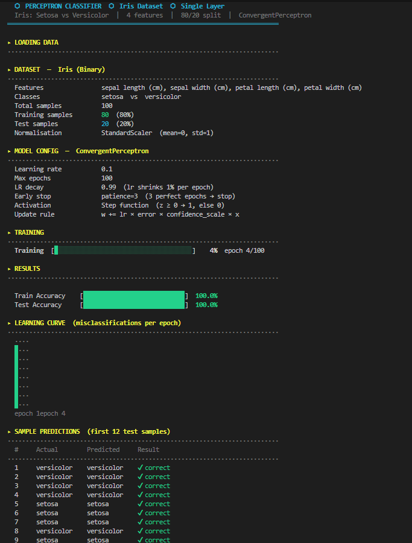

# Perceptron CLI — A From-Scratch ML Tool

A single-layer perceptron classifier built entirely with NumPy — no sklearn, 
no black boxes. Train, evaluate, save/load, and predict, all through a 
git-style CLI.



---

## What it does

- **Perceptron implemented from scratch** — weighted sums, activation, and 
  weight updates written manually, not via a library
- **Manual metrics** — confusion matrix, precision, recall, and F1 computed 
  from raw NumPy, not sklearn.metrics
- **Model persistence** — save trained weights *and* the scaler's mean/std 
  to disk, so predictions after reload match training-time behavior exactly
- **Run history** — every training run logs to a timestamped file; compare 
  hyperparameters across sessions
- **Git-style CLI** — subcommands (`train`, `predict`, `eval`, `history`, 
  `info`, `compare`) instead of one messy script

---

## Screenshots

### Confusion matrix (color-coded)


### Run history comparison


### CLI subcommands


---

## Quick example

```bash
python cli.py train --epochs 100 --lr 0.01
python cli.py predict --features 5.1 3.5 1.4 0.2
python cli.py eval --verbose
python cli.py history
```

---

## A few implementation notes

- The scaler's mean/std are saved alongside the weights — reloading a model 
  without them would silently break predictions, since `fit_transform` was 
  only correct at training time.
- Precision/recall/F1 are implemented manually since interviews expect you 
  to be able to derive them, not just call a library function.
- Currently a single-layer perceptron — linearly separable classification 
  only (works well on Iris; wouldn't solve something like XOR without a 
  hidden layer).

---

## What's next

- Extend to a multi-layer perceptron for non-linearly-separable problems
- Add unit tests for the metrics module